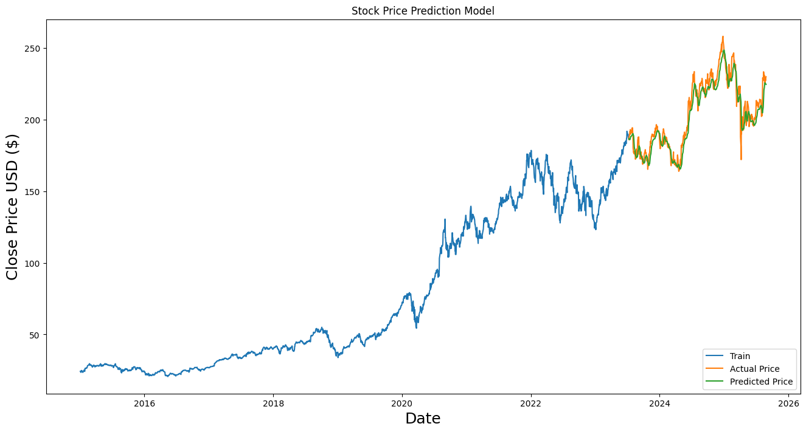

# Stock Price Prediction using LSTM

This project uses a Long Short-Term Memory (LSTM) neural network to predict the closing price of Apple Inc. (AAPL) stock. The model is built with Python using TensorFlow and Keras.

## 📜 Description

The goal of this project is to build a deep learning model that can forecast future stock prices based on historical data. It follows a standard machine learning workflow:

1.  **Data Acquisition**: Fetches historical stock data for Apple (`AAPL`) from 2015 to the present day using the `yfinance` library.
2.  **Data Preprocessing**: Normalizes the 'Close' prices to a range of (0, 1) using `MinMaxScaler` to improve model training stability.
3.  **Model Building**: Constructs a Sequential LSTM model with two LSTM layers, Dropout for regularization, and a Dense output layer for the final prediction.
4.  **Training**: Trains the model on 80% of the historical data, using the past 60 days of prices to predict the next day's price.
5.  **Evaluation & Visualization**: Makes predictions on the remaining 20% of the data and visualizes the results against the actual stock prices to assess performance.

## 🛠️ Technologies Used

* **Python 3**
* **yfinance**: For fetching stock market data.
* **Pandas**: For data manipulation and analysis.
* **NumPy**: For numerical operations.
* **Scikit-learn**: For data preprocessing (`MinMaxScaler`).
* **TensorFlow & Keras**: For building and training the LSTM model.
* **Matplotlib**: For plotting and visualizing the results.

## ⚙️ Installation and Usage

To run this project on your local machine, follow these steps:

1.  **Clone the repository:**
    ```bash
    git clone <your-repository-url>
    cd <your-repository-folder>
    ```

2.  **Create a virtual environment (optional but recommended):**
    ```bash
    python -m venv venv
    source venv/bin/activate  # On Windows, use `venv\Scripts\activate`
    ```

3.  **Install the required libraries:**
    ```bash
    pip install -r requirements.txt
    ```

4.  **Run the Jupyter Notebook:**
    Open and run the `Stock_Price_Prediction.ipynb` notebook in a Jupyter environment.

##  workflow

    

## 📊 Results

The model's predictions are plotted against the actual closing prices for the test period. The graph shows that the model is quite effective at tracking the general trend of the stock price.



## ⚠️ Disclaimer

This model is for educational purposes only and should not be used for making actual investment decisions. The stock market is highly volatile and influenced by many factors beyond historical data.

---
**Author**: Rama Krishna Reddy"# Stock-Price-Prediction-LSTM" 
